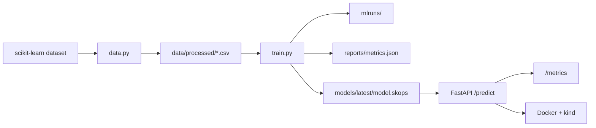

# Tabular MLOps Lab

[GitHub Repository](https://github.com/johnnymarquezv/tabular-mlops-lab)

Portfolio-ready MLOps project for a tabular classification model. It demonstrates
the path from reproducible data preparation to experiment tracking, model
artifact management, API inference, service metrics, containerization, and local
Kubernetes deployment.

The demo model uses scikit-learn's built-in breast cancer dataset to classify
tumor samples as `malignant` or `benign`.

> Educational project only. This model is not intended for medical use.

## Highlights

- Reproducible data and training pipeline with DVC
- Experiment tracking and artifact metadata with MLflow
- Safer scikit-learn artifact persistence with `skops`
- FastAPI inference service with browser docs at `/docs`
- Prometheus-compatible metrics at `/metrics`
- Docker image and `kind` Kubernetes manifests
- CI-ready checks with Ruff, mypy, and pytest
- Detailed documentation in `docs/`

## Tech Stack

Python, scikit-learn, pandas, MLflow, DVC, FastAPI, Pydantic, Prometheus client,
Docker, kind, Kubernetes, Ruff, mypy, pytest, GitHub Actions.

## Architecture



## Quickstart

Clone the repository:

```bash
git clone https://github.com/johnnymarquezv/tabular-mlops-lab.git
cd tabular-mlops-lab
```

Create the environment:

```bash
python3 -m venv .venv
.venv/bin/python -m pip install --upgrade pip
.venv/bin/python -m pip install -e ".[dev]"
```

Prepare data and train:

```bash
.venv/bin/python -m mlops_tabular.data
.venv/bin/python -m mlops_tabular.train
```

Start the API:

```bash
.venv/bin/uvicorn mlops_tabular.api:app --host 0.0.0.0 --port 8000 --reload
```

Open:

```text
http://127.0.0.1:8000/docs
```

## Useful Commands

Run checks:

```bash
.venv/bin/python -m ruff check .
.venv/bin/python -m mypy src tests
.venv/bin/python -m pytest
```

Reproduce the DVC pipeline:

```bash
.venv/bin/dvc repro
```

Open MLflow:

```bash
MLFLOW_ALLOW_FILE_STORE=true .venv/bin/mlflow ui --backend-store-uri ./mlruns --host 127.0.0.1 --port 5000
```

Deploy to local Kubernetes:

```bash
kind create cluster --name tabular-mlops-lab --config k8s/kind/cluster.yaml
docker build -t tabular-mlops-lab:latest .
kind load docker-image tabular-mlops-lab:latest --name tabular-mlops-lab
kubectl apply -k k8s/base
kubectl port-forward service/tabular-mlops-api 8000:80
```

## Documentation

- `docs/concepts.md`: MLOps concepts and tool choices
- `docs/end-to-end-flow.md`: how data, training, MLflow, artifacts, and the API connect
- `docs/workflows.md`: setup, data, training, serving, MLflow, DVC, and validation
- `docs/project-structure.md`: what each file and directory does
- `docs/artifacts-and-outputs.md`: generated outputs such as `data/`, `mlruns/`, `models/`, and `reports/`
- `docs/deployment.md`: Docker, `kind`, Kubernetes, and local-vs-cluster MLflow notes
- `docs/portfolio.md`: portfolio talking points, resume bullets, and extension ideas

## Repository Status

This is a learning and portfolio project. The architecture is intentionally
local-first, but the code structure mirrors a production-style ML service:
separate data, training, inference, observability, and deployment concerns.

## License

MIT
