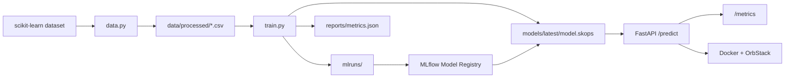

# Tabular MLOps Lab

[GitHub Repository](https://github.com/johnnymarquezv/tabular-mlops-lab)

Portfolio-ready MLOps project for a tabular classification model. It demonstrates
the path from reproducible data preparation to experiment tracking, model
artifact management, API inference, service metrics, containerization, and local
Kubernetes deployment.

The demo model uses scikit-learn's built-in breast cancer dataset to classify
tumor samples as `malignant` or `benign`.

> Educational project only. This model is not intended for medical use.

## Highlights

- Reproducible data and training pipeline with DVC
- Experiment tracking and artifact metadata with MLflow
- Safer scikit-learn artifact persistence with `skops`
- FastAPI inference service with browser docs at `/docs`
- Prometheus-compatible metrics at `/metrics`
- Docker image and OrbStack Kubernetes manifests
- CI-ready checks with Ruff, mypy, and pytest

## Tech Stack

Python, scikit-learn, pandas, MLflow, DVC, FastAPI, Pydantic, Prometheus client,
Docker, OrbStack, Kubernetes, Ruff, mypy, pytest, GitHub Actions.

## Architecture



## Quickstart

Clone the repository:

```bash
git clone https://github.com/johnnymarquezv/tabular-mlops-lab.git
cd tabular-mlops-lab
```

Create an environment outside the project and install dependencies:

```bash
python3 -m venv ~/.venvs/tabular-mlops-lab
source ~/.venvs/tabular-mlops-lab/bin/activate
python3 -m pip install --upgrade pip
python3 -m pip install -e ".[dev]"
```

Prepare data and train:

```bash
python3 -m dvc repro
```

Start the API:

```bash
python3 -m uvicorn mlops_tabular.api:app --host 0.0.0.0 --port 8000 --reload
```

Open:

```text
http://127.0.0.1:8000/docs
```

## Useful Commands

Run the automated local pipeline:

```bash
make repro
```

Run checks:

```bash
make test
```

Open MLflow:

```bash
make mlflow
```

Build and smoke-test the Docker image:

```bash
make docker-build
make docker-smoke
```

Deploy to local Kubernetes:

```bash
make k8s-deploy
make k8s-smoke
make k8s-port-forward
```

## Pipeline Flow

Data preparation creates a raw dataset snapshot and processed train/test splits:

```text
src/mlops_tabular/data.py -> data/raw/ + data/processed/
```

Training loads the processed data, fits a scikit-learn pipeline, logs an MLflow
run, registers a candidate model version, and saves the current serving artifact:

```text
src/mlops_tabular/train.py
  -> mlruns/
  -> models/latest/model.skops
  -> reports/metrics.json
```

Evaluation recomputes metrics from the saved serving model and enforces minimum
quality thresholds. Promotion moves the `champion` registry alias only after
evaluation passes.

The API loads `models/latest/model.skops` and serves predictions through
`POST /predict`. The response includes the predicted class, probabilities, the
MLflow run id, and the registered model name/version/alias.

## DVC

DVC defines the reproducible pipeline in `dvc.yaml`:

- `prepare_data`: runs `python3 -m mlops_tabular.data`
- `validate_data`: runs `python3 -m mlops_tabular.validate`
- `train`: runs `python3 -m mlops_tabular.train`
- `evaluate`: runs `python3 -m mlops_tabular.evaluate`
- `promote_model`: runs `python3 -m mlops_tabular.promote_model`

Use DVC to check whether generated outputs are stale:

```bash
python3 -m dvc status
```

Reproduce only the stages that need to run:

```bash
python3 -m dvc repro
```

`dvc.lock` records the dependency and output hashes from the latest known-good
pipeline run.

## MLflow And Registry

MLflow stores local experiment tracking and model registry metadata under:

```text
mlruns/
```

Each training run logs parameters, metrics, artifacts, and a scikit-learn model.
The run also registers a new version of `tabular-mlops-classifier`. The
promotion stage points the `champion` alias at that version after evaluation
passes.

MLflow separates the backend store from the artifact store conceptually:

- backend store: experiments, runs, params, metrics, tags, registry versions, and
  aliases
- artifact store: model files, reports, input examples, and other logged files

This local project does not configure a separate artifact destination. Both the
backend metadata and artifact files are stored under `mlruns/`.

Open the MLflow UI:

```bash
PYTHONPATH=. MLFLOW_ALLOW_FILE_STORE=true python3 -m mlflow ui --backend-store-uri ./mlruns --host 127.0.0.1 --port 5000
```

Then visit:

```text
http://127.0.0.1:5000
```

## API Example

Start the API:

```bash
python3 -m uvicorn mlops_tabular.api:app --host 0.0.0.0 --port 8000 --reload
```

Send a prediction request:

```bash
curl -X POST http://127.0.0.1:8000/predict \
  -H 'Content-Type: application/json' \
  -d '{"features":{"mean_radius":17.99,"mean_texture":10.38,"mean_perimeter":122.8,"mean_area":1001.0,"mean_smoothness":0.1184,"mean_compactness":0.2776,"mean_concavity":0.3001,"mean_concave_points":0.1471,"mean_symmetry":0.2419,"mean_fractal_dimension":0.07871,"radius_error":1.095,"texture_error":0.9053,"perimeter_error":8.589,"area_error":153.4,"smoothness_error":0.006399,"compactness_error":0.04904,"concavity_error":0.05373,"concave_points_error":0.01587,"symmetry_error":0.03003,"fractal_dimension_error":0.006193,"worst_radius":25.38,"worst_texture":17.33,"worst_perimeter":184.6,"worst_area":2019.0,"worst_smoothness":0.1622,"worst_compactness":0.6656,"worst_concavity":0.7119,"worst_concave_points":0.2654,"worst_symmetry":0.4601,"worst_fractal_dimension":0.1189}}'
```

## Deployment Notes

The Docker image needs `models/latest/model.skops` to exist before build time:

```bash
docker build -t tabular-mlops-lab:latest .
```

OrbStack Kubernetes can use the local OrbStack Docker image directly:

```bash
kubectl config use-context orbstack
kubectl apply -k k8s/base
kubectl port-forward service/tabular-mlops-api 8000:80
```

The service also exposes NodePort `30080`.

## Automation Targets

The `Makefile` wraps common local automation:

- `make setup`: create the external virtual environment and install dependencies
- `make repro`: run the full DVC pipeline
- `make test`: run Ruff, mypy, and pytest
- `make api`: start FastAPI locally
- `make mlflow`: start the MLflow UI
- `make docker-build`: build the API image
- `make docker-smoke`: run the image and check `/health`
- `make k8s-deploy`: apply Kubernetes manifests to OrbStack
- `make k8s-smoke`: check the Kubernetes rollout and `/health`
- `make clean`: remove generated local outputs

## Generated Outputs

These directories are generated locally and ignored by Git:

- `data/`: raw and processed CSV files
- `models/`: current serving model artifact
- `reports/`: validation, training, evaluation, and promotion reports
- `mlruns/`: MLflow runs, artifacts, registry versions, and aliases

To clean generated outputs and rebuild:

```bash
rm -rf data models reports mlruns
python3 -m dvc repro
```

## Repository Status

This is a learning and portfolio project. The architecture is intentionally
local-first, but the code structure mirrors a production-style ML service:
separate data, training, inference, observability, and deployment concerns.

## License

MIT
